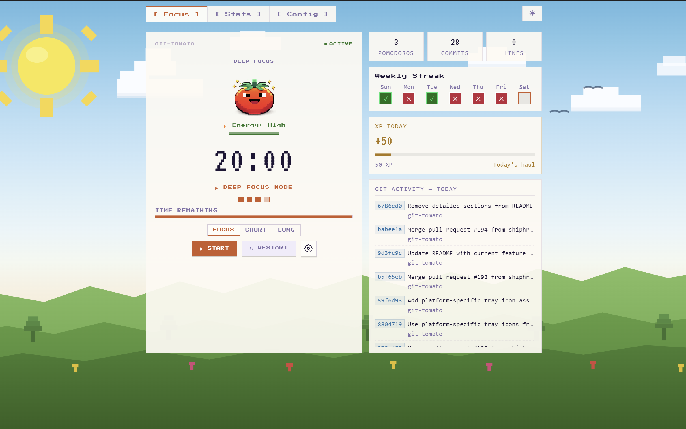
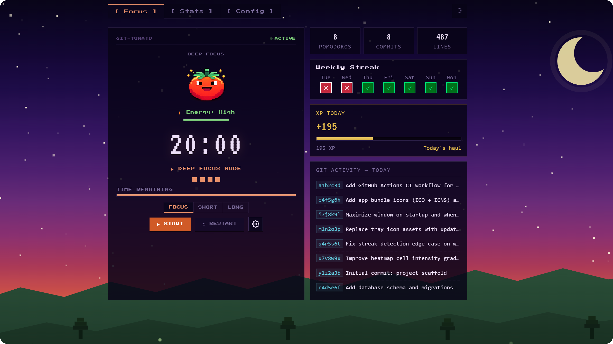
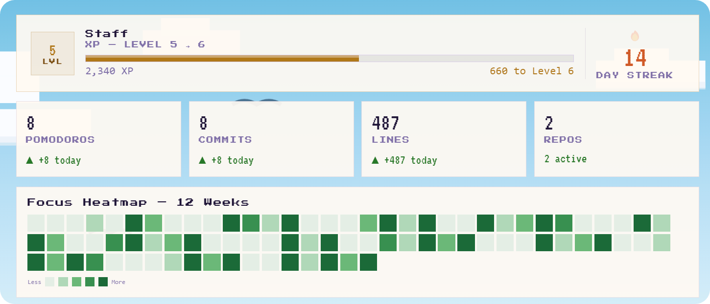
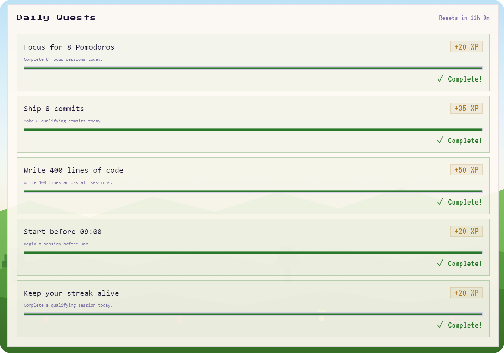

# 🍅 git-tomato

**Time your work. Prove it with commits.**

A desktop app that runs a Pomodoro timer and automatically links each focus session to your git commits. At the end of every session it scans your repos and shows exactly what you shipped during that block. Over time you build a commit heatmap, XP level, daily streaks, and badge collection — all driven by real coding output, not self-reported effort.

|  |  |
|---|---|

---

## What it does

Most Pomodoro apps tell you how long you worked. git-tomato tells you what you built.

Start a focus session, code, and when the timer ends git-tomato scans your configured repositories and attaches every commit made during that window to the session. No manual logging. The Stats tab then gives you a full picture of the day: commit heatmap, XP earned, lines changed, daily quests, and your badge collection.



## Features

### Timer
- **Pomodoro timer** with Focus, Short Break, and Long Break modes
- Pixel-art tomato mascot that degrades as time runs out
- Energy bar, session dots, and time-remaining bar
- Start / Pause / Resume / Restart controls
- Timer runs in the main process — keeps ticking even when the window is hidden

### Git integration
- **Automatic commit scanning** at session end — no setup required for standard repo locations
- Commits are linked to the session window they were made in
- Lines-changed tracking per session (additions + deletions)
- Anti-gaming qualifier: sessions with fewer than 5 lines changed don't award XP
- Warning shown in Config if `git` is not found on PATH

### Progression
- **XP system** — earn XP for qualifying focus sessions, scaled by commit volume
- **7 levels**: Seedling → Committer → Shipper → Maintainer → Staff → Principal → Legend
- **Daily streak** — consecutive productive days tracked with at-risk detection
- **Weekly streak** — visualised as a 7-day dot row in the Focus tab
- **24 achievement badges** with pixel-art SVG icons (earned badges shown first, locked shown greyed)
- **Daily quests** — generated fresh each day, resets at midnight



---

## Repo discovery

By default git-tomato scans these directories in your home folder for `.git` repos:

```
~/projects  ~/code  ~/dev  ~/src  ~/workspace
```

Any repo found there is included automatically. Add custom paths in the Config tab.

